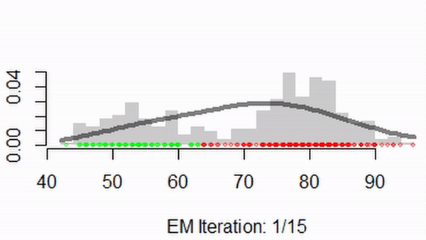

```{r setup, include=FALSE}
knitr::opts_chunk$set(echo = TRUE)
options(scipen=999)
```

<center></center>


##### **Authors:** Adrienn Timea Aszalos - Joelelle Coley - Giovanni Giunta - Daniel Jiménez
##### **Date:** 2021/01/17
##### **Subject:** Statistics for Data Science
##### **Data Science Master's programme**
##### **La Sapienza University of Rome**
_____

In this document, you can find a solution to the second homework proposed. 

## Setting environment up 

First things first, for you to be able to run this file from R Studio is necessary to have the next packages installed in your PC:

- `mixtools`: Used to handle (fit, generate random samples, etc) mixture models
- `ggplot2`: Used to provide statistical and other plots
- `tictoc`: Used to measure the running time of the executions


## Question 1 (EM fit function for k Mixture of Gaussians -MoG (k can be generic))

To fit a mixture of k Gaussians, we are developing an EM-Algorithm. Using the latter, we manage to estimate the proportions, means and standard deviation of the k desired number of components. Then, the function 
`handmade.em` will receive the next parameters:

**y:** The data that we will use to fit the mixture.

**p:** the proportion that each of the Gaussians will have. The number of components will be the length of the p vector.

**mu:** a vector corresponding to the starting values for the mean of each Gaussian.

**sigma:** a vector corresponding to the starting values of the standard deviation of each Gaussian.

**n_iter:** The number of iterations that the algorithm will perform.

**plot_flag:** A flag regarding whether to plot the histogram of the mixture or not.

```{r}
# Handmade EM4MoG ---------------------------------------------------------

handmade.em <- function(y, p, mu, sigma, n_iter, plot_flag = T)
{
  # Define epsilon to avoid zero divisions
  epsilon = 0.001
  
  # Define colors for plots
  cols     <- c(rgb(1,0,0,.3), rgb(0,1,0,.3))
  
  # Intitialize likelihood
  like <- 0
  
  # Get the number of components
  k = length(p)
  
  prev_deviance <- 0
  
  # Calculate likelihood
  for (i in 1:k) {
    # Cumulate each time the likelihood of a normal distribution
    like <- like + (p[i] * dnorm(y, mu[i], sigma[i]))
  }
  
  # Calculate Deviance
  deviance <- -2*sum(log(like))
  
  # Initialize table with results of each iteration
  res      <- matrix(NA,n_iter + 1, k * 3 + 2)
  
  # Put in the first cell the initial values
  res[1,]  <- c(0, p, mu, sigma, deviance)
  
  
  for (iter in 1:n_iter) {
    # E step
    d <- array(replicate(length(y) * k, 0), dim=c(k, length(y)))
    r <- array(replicate(length(y) * k, 0), dim=c(k, length(y)))
    
    # Store each normal distribution generated with parameters
    for (i in 1:k) {
      d[i,] <- p[i]*dnorm(y, mu[i], sigma[i])
    }
    
    # Define the new proportions based on previous normal distributions
    for (i in 1:k) {
      r[i, ] <- d[i, ] / colSums(d)
    }
    
    
    # M step
    for (i in 1:k) {
      # Estimate the proportions
      p[i] <- mean(r[i,])
      
      # Estimate the means
      mu[i]    <- sum(r[i,]*y)/(sum(r[i,])+epsilon)
      
      # Estimate the standard deviations
      sigma[i] <- sqrt( sum(r[i,]*(y^2))/(sum(r[i,])+epsilon) - (mu[i])^2 )
      
    }
    
    # Intitialize likelihood
    like <- 0
    
    # Calculate likelihood
    for (i in 1:k) {
      like <- like + (p[i] * dnorm(y, mu[i], sigma[i]))
    }
    
    # Calculate Deviance based on new estimators
    deviance <- -2*sum(log(like))
    
    # Save in the table the results of the estimations
    res[iter+1,] <- c(iter, p, mu, sigma, deviance)
    
    
    # Check if the deviance is null
    if(is.na(deviance)){
      deviance <- 0
      prev_deviance <- 0
    }
    
    # Configure an early stopping step
    if (abs(prev_deviance - deviance) < 0.0001){
      iter = n_iter
    }
    
    # Replace previous deviance with new deviance for the next iteration
    prev_deviance <- deviance
    
    # Plot obtained and real distributions in each iteration
    if (plot_flag){
      hist(y, prob = T, breaks = 30, col = gray(.8), border = NA, 
           main = "", xlab = paste("EM Iteration: ", iter, "/", n_iter, sep = ""))
      set.seed(123)
      points(jitter(y), rep(0,length(y)), 
             pch = 19, cex = .6, 
             col = cols[ (dnorm(y,mu[1],sigma[1]) > dnorm(y,mu[2],sigma[2])) + 1])
      curve(p[1]*dnorm(x,mu[1],sigma[1]) + p[2]*dnorm(x,mu[2],sigma[2]),
            lwd = 4, col = rgb(0,0,0,.5), add = TRUE)
      Sys.sleep(1.5)
    }
  }
  # Convert table of results to data frame
  res <- data.frame(res)
  
  # Rename the final table
  names(res) <- c("iteration", paste("p",seq(1,k),sep=""), paste("mu",seq(1,k),sep="")
                  , paste("sigma",seq(1,k),sep=""), "deviance")
  
  # Generate output of the function as a list of values
  out <- list(parameters = c(p = p, mu = mu, sigma = sigma), deviance = deviance, res = res)
  return(out)
}
```

#### The following example uses the generic EM fit function for k = 2.
```{r}
# Test if the function is estimating correctly the parameters
data("faithful")
handmade.em(faithful$waiting, 
                       p      = c(.5,.5), 
                       mu     = c(45,55), 
                       sigma  = c(8,8), 
                       n_iter = 15,
                       plot_flag = F)
```

<center></center>

In the previous gif, we can see that in each iteration that the handmade function based on the EM algorithm generates estimated values that look similar to the real distribution of the data used, in each iteration. Thus, we concluded that the function created is working properly.

## Question 2

Now we will test the performance of a random normal mixture distribution with a small sample size ($n = 50$). To achieve, that we used some tools provided by the package `mixtools`.

```{r}
suppressWarnings(suppressMessages(require(mixtools, quietly = T))) 
suppressWarnings(suppressMessages(require(caret, quietly = T))) 
suppressWarnings(suppressMessages(require(tictoc, quietly = T)))
suppressWarnings(suppressMessages(require(mclust, quietly = T))) 
suppressWarnings(suppressMessages(require(KScorrect, quietly = T))) 

options(scipen=999)
n <- 50 # Sample size 
XX <- rnormmix(n,
lambda = c(0.5, rep(0.1,5)), mu = c(0, ((0:4)/2)-1), sigma = c(1, rep(0.1,5)) )
# Make an histogram of the data
hist(XX, prob = T, col = gray(.8), border = NA,
main = paste("Data from Bart's density",sep=""), xlab = paste("n = ", n, sep = ""),
breaks = 50)
# Show the data points
rug(XX, col = rgb(0,0,0,.5))
# Plot the true density
true.den = function(x) 0.5*dnorm(x, 0, 1) + 0.1*dnorm(x,-1.0, 0.1) + 0.1*dnorm(x, -0.5, 0.1) + 0.1*dnorm(x, 0.0, 0.1) + 0.1*dnorm(x, 0.5, 0.1) +
0.1*dnorm(x, 1.0, 0.1)
curve(true.den, col = rgb(1,0,0,0.4), lwd = 3, n = 500, add = TRUE)
```

Clearly, with the previous chart, we can say that using a small sample there is a non-asymptotic shape for the Bart distribution. The previous means that the sampled data points do not seem to follow the distribution curve.

Now we will test the same functions used before but using a sample size of 1000 points.

```{r}
suppressWarnings(suppressMessages(require(mixtools, quietly = T))) # Package and function ?rnormmix
options(scipen=999)
n <- 1000 # Sample size 
XX <- rnormmix(n,
lambda = c(0.5, rep(0.1,5)), mu = c(0, ((0:4)/2)-1), sigma = c(1, rep(0.1,5)) )
# Make an histogram of the data
hist(XX, prob = T, col = gray(.8), border = NA,
main = paste("Data from Bart's density",sep=""), xlab = paste("n = ", n, sep = ""),
breaks = 50)
# Show the data points
rug(XX, col = rgb(0,0,0,.5))
# Plot the true density
true.den = function(x) 0.5*dnorm(x, 0, 1) + 0.1*dnorm(x,-1.0, 0.1) + 0.1*dnorm(x, -0.5, 0.1) + 0.1*dnorm(x, 0.0, 0.1) + 0.1*dnorm(x, 0.5, 0.1) +
0.1*dnorm(x, 1.0, 0.1) 
curve(true.den, col = rgb(1,0,0,0.4), lwd = 3, n = 500, add = TRUE)
```

Now, with the obtained figures we can see a reasonably asymptotic for the Bart distribution. The sampled data points match the Bart distribution. And if we continue to grow the sample size, the sampled distribution looks more similar to The Bart each time.


## Question 3

To solve the third exercise, we define the next function to calculate the log-likelihood given some data and the parameters estimated by the `handmade.em`. That likelihood will be the metric to compare and define the best number of components.

```{r}
# Function to calculate the log-likelihood from given data and parameters
log_like <- function(data, fit){
  # data: Data used to fit the distribution
  # fit: Object that contains the result of the application of the handmade.em function
  
  # Extract the number of components
  k <- length(fit$parameters) / 3
  
  # Extract the proportions
  ps <- fit$parameters[1:k]
  
  # Extract the estimations for the mean (mu)
  mus <- fit$parameters[(k+1):(k+k)]
  
  # Extract the estimations for the standard deviation (sigma)
  sigmas <- fit$parameters[(k+k+1):(k+k+k)]
  
  # Compute the likelihood
  like <- 0
  for (i in 1:k) {
    like <- like + (ps[i] * dnorm(data, mus[i], sigmas[i]))
  }
  
  # Compute the log-likelihood
  log_like <- log(like)
  
  return(log_like)
}
```

### a) 

With the next chunk of code, we apply the AIC model selection method to estimate the optimum k, number of components. To avoid a double calculation, we also computed the BIC from the same data. In this first case, we use a sample size of 50.

```{r tictoc caret M chunk24}
# Starting time
tictoc::tic()

# Define the desired number of iterations
M <- 500

# Define the seed for replicability
seed <- 1234

# Define the sample size
n <- 50

# Define the maximum number of components
k_max <- 10

# Pre-allocate memory for the optimum component in each iteration
best_k_n1_aic <- rep(NA,M)
best_k_n1_bic <- rep(NA,M)

# Simulate M times
for(i in 1:M){
  
  # Simulate from The Bart
  set.seed(seed)
  XX <- rnormmix(n,
                 lambda = c(0.5, rep(0.1,5)), mu = c(0, ((0:4)/2)-1), sigma = c(1, rep(0.1,5)) )
  
  # Pre-allocate memory for the optimum component in each iteration
  aic_values <- rep(NA,k_max)
  bic_values <- rep(NA,k_max)
  
  for(j in 1:k_max){
    
    # Define proportions
    ps <- rep(1,j) / j
    
    # Define mean values
    set.seed(seed)
    
    # Generating k random numbers between 0 and 1 and rounding them
    mus <- round(runif(j),0) 
    
    # Define sigma values
    set.seed(seed)
    sigmas <- round(runif(j),1) + 0.1
    
    # Estimating the three parameters using the XX values
    fit <- handmade.em(XX, p = ps, mu = mus, sigma = sigmas, n_iter = 15, plot_flag = F)
    
    # Compute AIC & BIC values to  estimates the optimum value of k
    aic_values[j] = fit$deviance + 2*j*3  # Multiplying by 3 which is the number of parameters
    
    bic_values[j] = fit$deviance + j*log(n)  # Multiplying by 3 which is the number of parameters
    
    seed <- seed + 100
  }
  
  # Calculate the position of the best AIC 
  best_k_n1_aic[i] <- which.min(aic_values)
  # Calculate the position of the best AIC 
  best_k_n1_bic[i] <- which.min(bic_values)
  
  seed <- seed + 100
  
}

# Ending time
tictoc::toc()

```

```{r best_k_n1_aic chunk25}
summary(best_k_n1_aic)
```

```{r chunk26, echo = FALSE}
print(paste("Standard deviation: ", round(sd(best_k_n1_aic),2), sep=""))
print(paste("Coefficient of variation (CV): ", round(sd(best_k_n1_aic) / mean(best_k_n1_aic)*100,2), "%", sep=""))
```

```{r ggplot2 M best_k_n1_aic chunk27}
ggplot2::ggplot(data.frame(best_k_n1_aic), ggplot2::aes(x=best_k_n1_aic))+
  ggplot2::geom_histogram(ggplot2::aes(y=..count../sum(..count..)), color="darkblue", fill="lightblue", bins =15)+
  ggplot2::labs(title = paste("Histogram of optimum components (k) of ", M, " simulations", sep=""), y = "Relative Frequency", x = "Number of components (k)")
```

As we can see from the previous charts and measures, most of the optimum number of components is close to 1. Besides, the variation of the data concerning the mean is close to 56%. The previous is a signal that taking a few data points is not useful to estimate the correct number of components (6) of the Bart distribution.

Now we execute the same process, using a sample size of 1000.

```{r tictoc caret M chunk34}
# Starting time
tictoc::tic()

# Define the desired number of iterations
M <- 500

# Define the seed for replicability
seed <- 1234

# Define the sample size
n <- 1000

# Define the maximum number of components
k_max <- 10

# Pre-allocate memory for the optimum component in each iteration
best_k_n2_aic <- rep(NA,M)
best_k_n2_bic <- rep(NA,M)

# Simulate M times
for(i in 1:M){
  
  # Simulate from The Bart
  set.seed(seed)
  XX <- rnormmix(n,
                 lambda = c(0.5, rep(0.1,5)), mu = c(0, ((0:4)/2)-1), sigma = c(1, rep(0.1,5)) )
  
  # Pre-allocate memory for the optimum component in each iteration
  aic_values <- rep(NA,k_max)
  bic_values <- rep(NA,k_max)
  
  for(j in 1:k_max){
    
    # Define proportions
    ps <- rep(1,j) / j
    
    # Define mean values
    set.seed(seed)
    
    # Generating k random numbers between 0 and 1 and rounding them
    mus <- round(runif(j),0) 
    
    # Define sigma values
    set.seed(seed)
    sigmas <- round(runif(j),1) + 0.1
    
    # Estimating the three parameters using the XX values
    fit <- handmade.em(XX, p = ps, mu = mus, sigma = sigmas, n_iter = 15, plot_flag = F)
    
    # Compute AIC & BIC values to  estimates the optimum value of k
    aic_values[j] = fit$deviance + 2*j*3  # Multiplying by 3 which is the number of parameters
    
    bic_values[j] = fit$deviance + j*log(n)  # Multiplying by 3 which is the number of parameters
    
    seed <- seed + 100
  }
  
  # Calculate the position of the best AIC 
  best_k_n2_aic[i] <- which.min(aic_values)
  # Calculate the position of the best AIC 
  best_k_n2_bic[i] <- which.min(bic_values)
  
  seed <- seed + 100
  
}

# Ending time
tictoc::toc()

```

```{r best_k_n2_aic chunk35}
summary(best_k_n2_aic)
```

```{r chunk36, echo = FALSE}
print(paste("Standard deviation: ", round(sd(best_k_n2_aic),2), sep=""))
print(paste("Coefficient of variation (CV): ", round(sd(best_k_n2_aic) / mean(best_k_n2_aic)*100,2), "%", sep=""))
```

```{r ggplot2 M best_k_n2_aic chunk37}
ggplot2::ggplot(data.frame(best_k_n2_aic), ggplot2::aes(x=best_k_n2_aic))+
  ggplot2::geom_histogram(ggplot2::aes(y=..count../sum(..count..)), color="darkblue", fill="lightblue", bins =15)+
  ggplot2::labs(title = paste("Histogram of optimum components (k) of ", M, " simulations", sep=""), y = "Relative Frequency", x = "Number of components (k)")
```

In this case, when using the AIC as a metric to choose the number of components, its distributions are quite symmetric. Besides, the values are around 5 (close to the real components). And the coefficient of variation is not high at all.

### b) 

As we ran the BIC in the previous literal, we only plot here its distribution when using a sample size of 50.

```{r best_k_n1_bic chunk38}
summary(best_k_n1_bic)
```

```{r chunk39, echo = FALSE}
print(paste("Standard deviation: ", round(sd(best_k_n1_bic),2), sep=""))
print(paste("Coefficient of variation (CV): ", round(sd(best_k_n1_bic) / mean(best_k_n1_bic)*100,2), "%", sep=""))
```

```{r ggplot2 M best_k_n1_bic chunk30}
ggplot2::ggplot(data.frame(best_k_n1_bic), ggplot2::aes(x=best_k_n1_bic))+
  ggplot2::geom_histogram(ggplot2::aes(y=..count../sum(..count..)), color="darkblue", fill="lightblue", bins =15)+
  ggplot2::labs(title = paste("Histogram of optimum components (k) of ", M, " simulations", sep=""), y = "Relative Frequency", x = "Number of components (k)")
```

As happened with the AIC, the number of components is close to 1. That behaviour is mainly caused due to the small sample size taken.

Now we analyze the distribution of the optimum values selected from a sample size of 1000 and using the BIC.

```{r best_k_n2_bic chunk48}
summary(best_k_n2_bic)
```

```{r chunk49, echo = FALSE}
print(paste("Standard deviation: ", round(sd(best_k_n2_bic),2), sep=""))
print(paste("Coefficient of variation (CV): ", round(sd(best_k_n2_bic) / mean(best_k_n2_bic)*100,2), "%", sep=""))
```

```{r ggplot2 M best_k_n2_bic chunk40}
ggplot2::ggplot(data.frame(best_k_n2_bic), ggplot2::aes(x=best_k_n2_bic))+
  ggplot2::geom_histogram(ggplot2::aes(y=..count../sum(..count..)), color="darkblue", fill="lightblue", bins =15)+
  ggplot2::labs(title = paste("Histogram of optimum components (k) of ", M, " simulations", sep=""), y = "Relative Frequency", x = "Number of components (k)")
```

Looking at the previous information, we can see how the distribution of the number of components is not that symmetric as the AIC, but mean the number of components is also close to 5. Also, the variation is around 53%.


### c)

To execute this simulation we defined a function that generates some data from The Bart and calculate the optimum number of components based on a train / test schema. The function goes as follows:

```{r}
sample_splitting <- function(seed, k_max, M, Z, n, p) {
  # seed: Seed for replicability
  # k_max: Maximum number of components to be considered
  # M: Number of iterations for the simulation
  # Z: Maximum number of iterations for the EM algorithm
  # n: Sample size
  # p: Proportion to split the data in train
  
  best_M <- rep(NA,M)
  
  for (i in 1:M) {
    
    # Update the seed
    seed <- seed + 100
    set.seed(seed)
    
    # Create dataset
    XX <- rnormmix(n, lambda=c(0.5,rep(0.1,5)), mu=c(0, ((0:4)/2)-1), sigma=c(1,rep(0.1,5)) )
    
    # Split data into training sample and test sample according to parameter "p"
    trainIndex <- createDataPartition(XX, p=p, list=FALSE)
    
    train_sample <- XX[trainIndex] # why not XX[trainIndex,] ???
    test_sample <- XX[-trainIndex] # why not XX[-trainIndex,] ???
    
    log_like_k <- rep(NA,k_max)
    
    for (k in 1:k_max) {
      
      # Update the seed
      seed <- seed + 100
      set.seed(seed)
      
      ps <- rep(1,k) / k
      
      # Define values for mu and sigma
      mus <- round(runif(k),0)
      sigmas <- round(runif(k),1) + 0.1
      
      # Fit the training data to estimate the parameters
      fit <- handmade.em(train_sample, p=ps, mu=mus, sigma=sigmas, n_iter=Z, plot_flag=F)
      
      # Apply the log-likelihood estimation over the test data
      log_like_k[k] <- sum(log_like(test_sample, fit))
      
    }
    best_M[i] <- which.max(log_like_k)
  }
  
  return(best_M)
}
```

Now we can execute the previous function to select the number of optimum components based on splitting in train = 50%  and test = 50%, using the sample size of 50.

```{r tictoc caret M }
tictoc::tic()

# Define the desired number of iterations
M <- 500

# Set number of iterations for the handmade EM function
Z <- 15

# Define the seed for replicability
seed <- 1234

# Define the maximum number of components
k_max <- 10

# Define the sample size
n <- 50

best_k_n1_Tr50_Te50 <- sample_splitting(seed, k_max, M, Z, n = n, p = 0.5)

tictoc::toc()
```


```{r best_k_n1_Tr50_Te50 chunk9}
summary(best_k_n1_Tr50_Te50)
```
```{r best_k_n1_Tr50_Te50 chunk4, echo = FALSE}
print(paste("Standard deviation: ", round(sd(best_k_n1_Tr50_Te50),2), sep=""))
print(paste("Coefficient of variation (CV): ", round(sd(best_k_n1_Tr50_Te50) / mean(best_k_n1_Tr50_Te50)*100,2), "%", sep=""))
```

```{r ggplot2 M best_k_n1_Tr50_Te50 chunk9}
ggplot2::ggplot(data.frame(best_k_n1_Tr50_Te50), ggplot2::aes(x=best_k_n1_Tr50_Te50))+
  ggplot2::geom_histogram(ggplot2::aes(y=..count../sum(..count..)), color="darkblue", fill="lightblue", bins =15)+
  ggplot2::labs(title = paste("Histogram of optimum components (k) of ", M, " simulations", sep=""), y = "Relative Frequency", x = "Number of components (k)")

```

In the previous results, we see that the distribution of the optimum components has a heavy right-tail. Besides, the mean number of components is close to 4. Nevertheless, the variation regarding the mean is higher than in the case of AIC and BIC methods.

Next step is to use the function to select the number of optimum components based on splitting in train = 50%  and test = 50%, using the sample size of 1000.

```{r tictoc caret M chunk1}
tictoc::tic()

# Define the desired number of iterations
M <- 500

# Set number of iterations for the handmade EM function
Z <- 15

# Define the seed for replicability
seed <- 1234

# Define the maximum number of components
k_max <- 10

# Define the sample size
n <- 1000

best_k_n2_Tr50_Te50 <- sample_splitting(seed, k_max, M, Z, n = n, p = 0.5)

tictoc::toc()
```

```{r best_k_n2_Tr50_Te50 chunk10}
summary(best_k_n2_Tr50_Te50)
```
```{r best_k_n2_Tr50_Te50 chunk4, echo = FALSE}
print(paste("Standard deviation: ", round(sd(best_k_n2_Tr50_Te50),2), sep=""))
print(paste("Coefficient of variation (CV): ", round(sd(best_k_n2_Tr50_Te50) / mean(best_k_n2_Tr50_Te50)*100,2), "%", sep=""))
```

```{r ggplot2 M best_k_n2_Tr50_Te50 chunk10}
ggplot2::ggplot(data.frame(best_k_n2_Tr50_Te50), ggplot2::aes(x=best_k_n2_Tr50_Te50))+
  ggplot2::geom_histogram(ggplot2::aes(y=..count../sum(..count..)), color="darkblue", fill="lightblue", bins =15)+
  ggplot2::labs(title = paste("Histogram of optimum components (k) of ", M, " simulations", sep=""), y = "Relative Frequency", x = "Number of components (k)")

```

Clearly, the distribution of k is left heavy-tailed. In this case, the average number of components is 7 (closer to the real one that is 6). Besides, the variation of those points is very low (near to 26%).

### d)

Now we can execute the function defined in the previous literal to select the number of optimum components based on splitting in train = 70%  and test = 30%, using the sample size of 50.

```{r tictoc caret M chunk4}
tictoc::tic()

# Define the desired number of iterations
M <- 500

# Set number of iterations for the handmade EM function
Z <- 15

# Define the seed for replicability
seed <- 1234

# Define the maximum number of components
k_max <- 10

# Define the sample size
n <- 50

best_k_n1_Tr70_Te30 <- sample_splitting(seed, k_max, M, Z, n = n, p = 0.7)

tictoc::toc()
```

```{r best_k_n1_Tr70_Te30 chunk11}
summary(best_k_n1_Tr70_Te30)
```
```{r best_k_n1_Tr70_Te30 chunk4, echo = FALSE}
print(paste("Standard deviation: ", round(sd(best_k_n1_Tr70_Te30),2), sep=""))
print(paste("Coefficient of variation (CV): ", round(sd(best_k_n1_Tr70_Te30) / mean(best_k_n1_Tr70_Te30)*100,2), "%", sep=""))
```

```{r ggplot2 M best_k_n1_Tr70_Te30 chunk11}
ggplot2::ggplot(data.frame(best_k_n1_Tr70_Te30), ggplot2::aes(x=best_k_n1_Tr70_Te30))+
  ggplot2::geom_histogram(ggplot2::aes(y=..count../sum(..count..)), color="darkblue", fill="lightblue", bins =15)+
  ggplot2::labs(title = paste("Histogram of optimum components (k) of ", M, " simulations", sep=""), y = "Relative Frequency", x = "Number of components (k)")

```


In this case, the optimum components mean is 5. But, the coefficient of variation is quite high (64%). Although the distribution has many occurrences near to the value 1, the remaining components (from 2 to 10) have higher participation compared to the previous literals.

Next step is to use the function to select the number of optimum components based on splitting in train = 70%  and test = 30%, using the sample size of 1000.

```{r tictoc caret M chunk9}
tictoc::tic()

# Define the desired number of iterations
M <- 500

# Set number of iterations for the handmade EM function
Z <- 15

# Define the seed for replicability
seed <- 1234

# Define the maximum number of components
k_max <- 10

# Define the sample size
n <- 1000

best_k_n2_Tr70_Te30 <- sample_splitting(seed, k_max, M, Z, n = n, p = 0.7)

tictoc::toc()
```

```{r best_k_n2_Tr70_Te30 chunk12}
summary(best_k_n2_Tr70_Te30)
```
```{r best_k_n2_Tr70_Te30 chunk4, echo = FALSE}
print(paste("Standard deviation: ", round(sd(best_k_n2_Tr70_Te30),2), sep=""))
print(paste("Coefficient of variation (CV): ", round(sd(best_k_n2_Tr70_Te30) / mean(best_k_n2_Tr70_Te30)*100,2), "%", sep=""))
```

```{r ggplot2 M best_k_n2_Tr70_Te30 chunk12}
ggplot2::ggplot(data.frame(best_k_n2_Tr70_Te30), ggplot2::aes(x=best_k_n2_Tr70_Te30))+
  ggplot2::geom_histogram(ggplot2::aes(y=..count../sum(..count..)), color="darkblue", fill="lightblue", bins =15)+
  ggplot2::labs(title = paste("Histogram of optimum components (k) of ", M, " simulations", sep=""), y = "Relative Frequency", x = "Number of components (k)")

```

The distribution of k has now many values close to 10. In this case, the main number of components is 8. Besides, the variation of those points is still low (near to 27%).

### e)

We can execute the function defined in the literal c) to select the number of optimum components based on splitting in train = 30%  and test = 70%, using the sample size of 50.

```{r tictoc caret M  chunk5}
tictoc::tic()

# Define the desired number of iterations
M <- 500

# Set number of iterations for the handmade EM function
Z <- 15

# Define the seed for replicability
seed <- 1234

# Define the maximum number of components
k_max <- 10

# Define the sample size
n <- 50

best_k_n1_Tr30_Te70 <- sample_splitting(seed, k_max, M, Z, n = n, p = 0.3)

tictoc::toc()
```


```{r best_k_n1_Tr30_Te70 chunk13}
summary(best_k_n1_Tr30_Te70)
```
```{r best_k_n1_Tr30_Te70 chunk4, echo = FALSE}
print(paste("Standard deviation: ", round(sd(best_k_n1_Tr30_Te70),2), sep=""))
print(paste("Coefficient of variation (CV): ", round(sd(best_k_n1_Tr30_Te70) / mean(best_k_n1_Tr30_Te70)*100,2), "%", sep=""))
```

```{r ggplot2 M best_k_n1_Tr30_Te70 chunk13}
ggplot2::ggplot(data.frame(best_k_n1_Tr30_Te70), ggplot2::aes(x=best_k_n1_Tr30_Te70))+
  ggplot2::geom_histogram(ggplot2::aes(y=..count../sum(..count..)), color="darkblue", fill="lightblue", bins =15)+
  ggplot2::labs(title = paste("Histogram of optimum components (k) of ", M, " simulations", sep=""), y = "Relative Frequency", x = "Number of components (k)")

```

In this case, the number of components near 1 is considerably high. The average value is close to 2 components, and the variation is the highest that we have seen so far (94%).

Next step is to use the function to select the number of optimum components based on splitting in train = 30%  and test = 70%, using the sample size of 1000.

```{r tictoc caret M  chunk6}
tictoc::tic()

# Define the desired number of iterations
M <- 500

# Set number of iterations for the handmade EM function
Z <- 15

# Define the seed for replicability
seed <- 1234

# Define the maximum number of components
k_max <- 10

# Define the sample size
n <- 1000

best_k_n2_Tr30_Te70 <- sample_splitting(seed, k_max, M, Z, n = n, p = 0.3)

tictoc::toc()
```

```{r best_k_n2_Tr30_Te70 chunk14}
summary(best_k_n2_Tr30_Te70)
```
```{r best_k_n2_Tr30_Te70 chunk4, echo = FALSE}
print(paste("Standard deviation: ", round(sd(best_k_n2_Tr30_Te70),2), sep=""))
print(paste("Coefficient of variation (CV): ", round(sd(best_k_n2_Tr30_Te70) / mean(best_k_n2_Tr30_Te70)*100,2), "%", sep=""))
```

```{r ggplot2 M best_k_n2_Tr30_Te70 chunk14}
ggplot2::ggplot(data.frame(best_k_n2_Tr30_Te70), ggplot2::aes(x=best_k_n2_Tr30_Te70))+
  ggplot2::geom_histogram(ggplot2::aes(y=..count../sum(..count..)), color="darkblue", fill="lightblue", bins =15)+
  ggplot2::labs(title = paste("Histogram of optimum components (k) of ", M, " simulations", sep=""), y = "Relative Frequency", x = "Number of components (k)")

```

The behaviour of the optimum components this time tends to have many values in higher k. The mean value is close to 7, and the variation is just 29% (it deviates like 2 components on average from the mean).

### f)

To solve this and the next literal, we implemented our cross-validation process. That can be seen in the next function. 

```{r}
# Function that executes the cross-validation process
cross_val <-function(data, folds, seed, k){
  # data: Data to calculate the cross-validations
  # folds: Number of folds desired
  # seed: Random seed to get reproducible results
  # k: Number of components to use
  
  # Create the folds    
  set.seed(seed)
  folds_from_data <- createFolds(data, k = folds)
  
  # Pre-allocate memory for the log likelihood values in each fold
  loglike_all <- rep(NA,folds)
  for(i in 1:folds){
    
    # Define proportions
    ps <- rep(1,k) / k
    
    # Define mean values
    set.seed(seed)
    mus <- round(runif(k,min = -1,max = 1),0)
    
    # Define sigma values
    set.seed(seed)
    sigmas <- round(runif(k,min = 0.1, max = 1),1)
    
    # Get train and test data
    train <- data[unlist(folds_from_data[-i], use.names=FALSE)]
    test <- data[-unlist(folds_from_data[-i], use.names=FALSE)]
    
    # Fit using the selected folds
    fit <- handmade.em(train, p = ps, mu = mus, sigma = sigmas, n_iter = 15, plot_flag = F)
    
    # Calculate log-likelihood with remaining fold
    loglike_all[i] <- sum(log_like(test, fit))
  }
  
  # Summarize result of cross validation
  mean_loglike <- mean(loglike_all, na.rm = T)
  
  return(mean_loglike)
}
```

Now we proceed to determine the optimum number of components based on a 5-fold cross-validation approach. The first run is made with a sample size of 50.

```{r tictoc caret M chunk7}
tictoc::tic()
# Define the desired number of iterations
M <- 500

# Define the seed for replicability
seed <- 1234

# Define the sample size
n <- 50

# Define the maximum number of components
k_max <- 10

# Define the number of folds
n_folds <- 5


# Pre-allocate memory for the optimum component in each iteration
best_k_n1_5cv <- rep(NA,M)

# Loop over desired number of iterations
for(i in 1:M){
  # Simulate from The Bart
  set.seed(seed)
  XX <- rnormmix(n,
                 lambda = c(0.5, rep(0.1,5)), mu = c(0, ((0:4)/2)-1), sigma = c(1, rep(0.1,5)) )
  
  # Set the possible components to check
  k <- 1:k_max
  # Pre-allocate memory for the optimum component in each iteration
  log_like_cross <- rep(NA,k_max)
  for(j in 1:k_max){
    log_like_cross[j] <- cross_val(XX, n_folds, seed, j)
    seed <- seed + 100
  }
  
  best_k_n1_5cv[i] <- which.max(log_like_cross)
  
  seed <- seed + 100
}
tictoc::toc()

```

```{r best_k_n1_5cv chunk}
summary(best_k_n1_5cv)
```
```{r chunk1, echo = FALSE}
print(paste("Standard deviation: ", round(sd(best_k_n1_5cv),2), sep=""))
print(paste("Coefficient of variation (CV): ", round(sd(best_k_n1_5cv) / mean(best_k_n1_5cv)*100,2), "%", sep=""))
```

```{r ggplot2 M best_k_n1_5cv}
ggplot2::ggplot(data.frame(best_k_n1_5cv), ggplot2::aes(x=best_k_n1_5cv))+
  ggplot2::geom_histogram(ggplot2::aes(y=..count../sum(..count..)), color="darkblue", fill="lightblue", bins =15)+
  ggplot2::labs(title = paste("Histogram of optimum components (k) of ", M, " simulations", sep=""), y = "Relative Frequency", x = "Number of components (k)")

```

Using 5-fold cross-validation leads an asymmetric distribution with many components near to 1. The mean value es 3 and it has a high variability (close to 80%).

The second run is made with a sample size of 1000.

```{r tictoc caret M chunk2}
tictoc::tic()
# Define the desired number of iterations
M <- 500

# Define the seed for replicability
seed <- 1234

# Define the sample size
n <- 1000

# Define the maximum number of components
k_max <- 10

# Define the number of folds
n_folds <- 5


# Pre-allocate memory for the optimum component in each iteration
best_k_n2_5cv <- rep(NA,M)

# Loop over desired number of iterations
for(i in 1:M){
  # Simulate from The Bart
  set.seed(seed)
  XX <- rnormmix(n,
                 lambda = c(0.5, rep(0.1,5)), mu = c(0, ((0:4)/2)-1), sigma = c(1, rep(0.1,5)) )
  
  # Set the possible components to check
  k <- 1:k_max
  # Pre-allocate memory for the optimum component in each iteration
  log_like_cross <- rep(NA,k_max)
  for(j in 1:k_max){
    log_like_cross[j] <- cross_val(XX, n_folds, seed, j)
    seed <- seed + 100
  }
  
  best_k_n2_5cv[i] <- which.max(log_like_cross)
  
  seed <- seed + 100
}
tictoc::toc()


```

```{r best_k_n2_5cv chunk1}
summary(best_k_n2_5cv)
```
```{r chunk7, echo = FALSE}
print(paste("Standard deviation: ", round(sd(best_k_n2_5cv),2), sep=""))
print(paste("Coefficient of variation (CV): ", round(sd(best_k_n2_5cv) / mean(best_k_n2_5cv)*100,2), "%", sep=""))
```

```{r ggplot2 M best_k_n2_5cv chun1}
ggplot2::ggplot(data.frame(best_k_n2_5cv), ggplot2::aes(x=best_k_n2_5cv))+
  ggplot2::geom_histogram(ggplot2::aes(y=..count../sum(..count..)), color="darkblue", fill="lightblue", bins =15)+
  ggplot2::labs(title = paste("Histogram of optimum components (k) of ", M, " simulations", sep=""), y = "Relative Frequency", x = "Number of components (k)")

```

When increasing the sample size, the distribution now seems left heavy-tailed. It presents a mean of 8 components (the highest so far) and a small variation of 22%.

### g)

Now that we have performed the analysis using 5-fold cross-validation, we can extend the same approach but using 10 folds. Again, the first run is made with a sample size of 50.

```{r tictoc caret M chunk8}
tictoc::tic()
# Define the desired number of iterations
M <- 500

# Define the seed for replicability
seed <- 1234

# Define the sample size
n <- 50

# Define the maximum number of components
k_max <- 10

# Define the number of folds
n_folds <- 10


# Pre-allocate memory for the optimum component in each iteration
best_k_n1_10cv <- rep(NA,M)

# Loop over desired number of iterations
for(i in 1:M){
  # Simulate from The Bart
  set.seed(seed)
  XX <- rnormmix(n,
                 lambda = c(0.5, rep(0.1,5)), mu = c(0, ((0:4)/2)-1), sigma = c(1, rep(0.1,5)) )
  
  # Set the possible components to check
  k <- 1:k_max
  # Pre-allocate memory for the optimum component in each iteration
  log_like_cross <- rep(NA,k_max)
  for(j in 1:k_max){
    log_like_cross[j] <- cross_val(XX, n_folds, seed, j)
    seed <- seed + 100
  }
  
  best_k_n1_10cv[i] <- which.max(log_like_cross)
  
  seed <- seed + 100
}
tictoc::toc()

```

```{r best_k_n1_10cv chunk2}
summary(best_k_n1_10cv)
```
```{r chunk5, echo = FALSE}
print(paste("Standard deviation: ", round(sd(best_k_n1_10cv),2), sep=""))
print(paste("Coefficient of variation (CV): ", round(sd(best_k_n1_10cv) / mean(best_k_n1_10cv)*100,2), "%", sep=""))
```

```{r ggplot2 M best_k_n1_10cv chunk}
ggplot2::ggplot(data.frame(best_k_n1_10cv), ggplot2::aes(x=best_k_n1_10cv))+
  ggplot2::geom_histogram(ggplot2::aes(y=..count../sum(..count..)), color="darkblue", fill="lightblue", bins =15)+
  ggplot2::labs(title = paste("Histogram of optimum components (k) of ", M, " simulations", sep=""), y = "Relative Frequency", x = "Number of components (k)")

```

Increasing the number of folds does not make a huge difference, at least when taking a small sample size. With the previous information, we get that the distribution remains asymmetric, and the mean number of components is 3. 

Now, the second run is made with a sample size of 1000.

```{r tictoc caret M chunk3}
tictoc::tic()
# Define the desired number of iterations
M <- 500

# Define the seed for replicability
seed <- 1234

# Define the sample size
n <- 1000

# Define the maximum number of components
k_max <- 10

# Define the number of folds
n_folds <- 10


# Pre-allocate memory for the optimum component in each iteration
best_k_n2_10cv <- rep(NA,M)

# Loop over desired number of iterations
for(i in 1:M){
  # Simulate from The Bart
  set.seed(seed)
  XX <- rnormmix(n,
                 lambda = c(0.5, rep(0.1,5)), mu = c(0, ((0:4)/2)-1), sigma = c(1, rep(0.1,5)) )
  
  # Set the possible components to check
  k <- 1:k_max
  # Pre-allocate memory for the optimum component in each iteration
  log_like_cross <- rep(NA,k_max)
  for(j in 1:k_max){
    log_like_cross[j] <- cross_val(XX, n_folds, seed, j)
    seed <- seed + 100
  }
  
  best_k_n2_10cv[i] <- which.max(log_like_cross)
  
  seed <- seed + 100
}
tictoc::toc()

```

```{r best_k_n2_10cv chunk3}
summary(best_k_n2_10cv)
```
```{r best_k_n2_10cv chunk4, echo = FALSE}
print(paste("Standard deviation: ", round(sd(best_k_n2_10cv),2), sep=""))
print(paste("Coefficient of variation (CV): ", round(sd(best_k_n2_10cv) / mean(best_k_n2_10cv)*100,2), "%", sep=""))
```

```{r ggplot2 M best_k_n2_10cv chunk1}
ggplot2::ggplot(data.frame(best_k_n2_10cv), ggplot2::aes(x=best_k_n2_10cv))+
  ggplot2::geom_histogram(ggplot2::aes(y=..count../sum(..count..)), color="darkblue", fill="lightblue", bins =15)+
  ggplot2::labs(title = paste("Histogram of optimum components (k) of ", M, " simulations", sep=""), y = "Relative Frequency", x = "Number of components (k)")

```

When we increased the sample size, the distribution completely changes. Now the average number of components is 8, and the variation is perhaps one of the smallest (22%).

### h) 

Now we define a function that provides a way to compute the Wasserstein based score using some parameters.

```{r}
wass_score <- function(seed, k_max, M, Z, n, p) {
  # seed: Seed for replicability
  # k_max: Maximum number of components to be considered
  # M: Number of iterations for the simulation
  # Z: Maximum number of iterations for the EM algorithm
  # n: Sample size
  # p: Proportion to split the data in train
  
  best_M <- rep(NA,M)
  
  for (i in 1:M) {
    
    # Update the seed
    seed <- seed + 100
    set.seed(seed)
    
    # Create dataset
    XX <- rnormmix(n, lambda=c(0.5,rep(0.1,5)), mu=c(0, ((0:4)/2)-1), sigma=c(1,rep(0.1,5)) )
    
    # Split data into training sample and test sample according to parameter "p"
    trainIndex <- createDataPartition(XX, p=p, list=FALSE)
    
    train_sample <- XX[trainIndex]
    test_sample <- XX[-trainIndex]
    
    scores_k <- rep(NA,k_max)
    
    for (k in 1:k_max) {
      
      # Update the seed
      seed <- seed + 100
      set.seed(seed)
      
      ps <- rep(1,k) / k
      
      # Define values for mu and sigma
      mus <- round(runif(k),0)
      sigmas <- round(runif(k),1) + 0.1
      
      # Fit the training data to estimate the parameters
      fit <- handmade.em(train_sample, p=ps, mu=mus, sigma=sigmas, n_iter=Z, plot_flag=F)
      
      est_ps <- fit$parameters[1:k]
      est_mus <- fit$parameters[(k+1):(k+k)]
      est_sigmas <- fit$parameters[(k+k+1):(k+k+k)]
      
      if ( sum(is.na(est_ps)) == 0 & sum(is.na(est_sigmas)) == 0 ) {
        
        quantiles = seq(0, 1, .01)
      
        inv_F_k <- dmixnorm(quantiles, mean=est_mus, sd=est_sigmas, pro=est_ps)
  
        
        ecdf_F_test <- ecdf(test_sample)
        inv_F_test <- quantile(ecdf_F_test, probs=quantiles)
        
        F_diff <- inv_F_k - inv_F_test
        scores_k[k] <- sum(abs(F_diff))
        
      } else {
        scores_k[k] <- 10000
      }
      

    }
    best_M[i] <- which.min(scores_k)
  }
  
  return(best_M)
}

```

So, we take the sample size equals to 50 to evaluate the performance of this measurement.

```{r}

tictoc::tic()

# Define the desired number of iterations
M <- 500

# Set number of iterations for the handmade EM function
Z <- 15

# Define the seed for replicability
seed <- 1234

# Define the maximum number of components
k_max <- 10

# Define the sample size
n <- 50

p <- 0.5

best_k_n1_wass <- wass_score(seed, k_max, M, Z, n, p)

tictoc::toc()

```

```{r best_k_n1_wass chunk53}
summary(best_k_n1_wass)
```
```{r best_k_n1_wass chunk54, echo = FALSE}
print(paste("Standard deviation: ", round(sd(best_k_n1_wass),2), sep=""))
print(paste("Coefficient of variation (CV): ", round(sd(best_k_n1_wass) / mean(best_k_n1_wass)*100,2), "%", sep=""))
```

```{r ggplot2 M best_k_n1_wass chunk55}
ggplot2::ggplot(data.frame(best_k_n1_wass), ggplot2::aes(x=best_k_n1_wass))+
  ggplot2::geom_histogram(ggplot2::aes(y=..count../sum(..count..)), color="darkblue", fill="lightblue", bins =15)+
  ggplot2::labs(title = paste("Histogram of optimal components (k) of ", M, " simulations", sep=""), y = "Relative Frequency", x = "Number of components (k)")

```

Using the Wasserstein based score provided better results than the other methods, even for small sample size. In this case, the mean value is close to 6, and the variation is about 50%.


```{r}

tictoc::tic()

# Define the desired number of iterations
M <- 500

# Set number of iterations for the handmade EM function
Z <- 15

# Define the seed for replicability
seed <- 1234

# Define the maximum number of components
k_max <- 10

# Define the sample size
n <- 1000

p <- 0.5

best_k_n2_wass <- wass_score(seed, k_max, M, Z, n, p)

tictoc::toc()

```

```{r best_k_n2_wass chunk63}
summary(best_k_n2_wass)
```
```{r best_k_n2_wass chunk64, echo = FALSE}
print(paste("Standard deviation: ", round(sd(best_k_n2_wass),2), sep=""))
print(paste("Coefficient of variation (CV): ", round(sd(best_k_n2_wass) / mean(best_k_n2_wass)*100,2), "%", sep=""))
```

```{r ggplot2 M best_k_n2_wass chunk65}
ggplot2::ggplot(data.frame(best_k_n2_wass), ggplot2::aes(x=best_k_n2_wass))+
  ggplot2::geom_histogram(ggplot2::aes(y=..count../sum(..count..)), color="darkblue", fill="lightblue", bins =15)+
  ggplot2::labs(title = paste("Histogram of optimal components (k) of ", M, " simulations", sep=""), y = "Relative Frequency", x = "Number of components (k)")

```

Finally, taking a large sample size, the Wasserstein based score generates better results. We obtained a mean of a solid 6 (the same than the real data) and with a variation of only 35%.

## Question 4

Finally we want to analyze the distribution of the chosen components in each iteration. To achieve that we use an Mean Squared Error (MSE) metric (as a function) to compare the performance of each the simulations against the real value of 6 components. 

```{r chunk8}
# Function to calculate Mean Squared Error
mse_func <- function(y, true_value){
  # y: vector corresponding to the result of iterations
  # true_value: True number of components
  return(var(y) + (mean(y) - true_value)^2)
}
```

Once we have defined the function to calculate the MSE, we can apply it to each one of the methods exposed before, for the first sample size of n = 50.

```{r best_k_n1_Tr50_Te50 best_k_n1_Tr70_Te30 best_k_n1_Tr30_Te70 best_k_n1_5cv best_k_n1_10cv chunk1 ggplot2}
# Pre-allocate vector to store MSE by method
mse_vector <- rep(NA, 8)
# Mean squared error for selection with AIC
mse_vector[1] <- mse_func(y = best_k_n1_aic, true_value = 6)
# Mean squared error for selection with BIC
mse_vector[2] <- mse_func(y = best_k_n1_bic, true_value = 6)
# Mean squared error for selection with split train = 50% / test = 50%
mse_vector[3] <- mse_func(y = best_k_n1_Tr50_Te50, true_value = 6)
# Mean squared error for selection with split train = 70% / test = 30%
mse_vector[4] <- mse_func(y = best_k_n1_Tr70_Te30, true_value = 6)
# Mean squared error for selection with split train = 30% / test = 70%
mse_vector[5] <- mse_func(y = best_k_n1_Tr30_Te70, true_value = 6)
# Mean squared error for 5-fold cross-validation
mse_vector[6] <- mse_func(y = best_k_n1_5cv, true_value = 6)
# Mean squared error for 10-fold cross-validation
mse_vector[7] <- mse_func(y = best_k_n1_10cv, true_value = 6)
# Mean squared error for Wasserstein based score
mse_vector[8] <- mse_func(y = best_k_n1_wass, true_value = 6)

mse_vector <- data.frame(mse_vector)
mse_vector$Methods <- c("AIC", "BIC", "Tr50/Te50", "Tr70/Te30", "Tr30/Te70", "5F-CV", "10F-CV","Wass")

# PLot MSE
ggplot2::ggplot(data=mse_vector, ggplot2::aes(x=Methods, y=mse_vector))+
  geom_bar(stat="identity", fill="lightblue", color="darkblue")+
  ggplot2::labs(title = paste("Comparisson of Methods to choose optimum components of sample size of ", 50, sep=""), y = "MSE", x = "Method")

```

When the sample size is 50, we can see that the best way to select the optimum number of components is by Wasserstein based score approach since it's the one that generates the lowest MSE. Moreover, AIC and BIC methods are the worsts.


Finally we apply the MSE the methods exposed before, for the second sample size of n = 1000.

```{r best_k_n2_Tr50_Te50 best_k_n2_Tr70_Te30 best_k_n2_Tr30_Te70 best_k_n2_5cv best_k_n2_10cv chunk1 ggplot2}
# Pre-allocate vector to store MSE by method
mse_vector <- rep(NA, 8)
# Mean squared error for selection with AIC
mse_vector[1] <- mse_func(y = best_k_n2_aic, true_value = 6)
# Mean squared error for selection with BIC
mse_vector[2] <- mse_func(y = best_k_n2_bic, true_value = 6)
# Mean squared error for selection with split train = 50% / test = 50%
mse_vector[3] <- mse_func(y = best_k_n2_Tr50_Te50, true_value = 6)
# Mean squared error for selection with split train = 70% / test = 30%
mse_vector[4] <- mse_func(y = best_k_n2_Tr70_Te30, true_value = 6)
# Mean squared error for selection with split train = 30% / test = 70%
mse_vector[5] <- mse_func(y = best_k_n2_Tr30_Te70, true_value = 6)
# Mean squared error for 5-fold cross-validation
mse_vector[6] <- mse_func(y = best_k_n2_5cv, true_value = 6)
# Mean squared error for 10-fold cross-validation
mse_vector[7] <- mse_func(y = best_k_n2_10cv, true_value = 6)
# Mean squared error for Wasserstein based score
mse_vector[8] <- mse_func(y = best_k_n2_wass, true_value = 6)

mse_vector <- data.frame(mse_vector)
mse_vector$Methods <- c("AIC", "BIC", "Tr50/Te50", "Tr70/Te30", "Tr30/Te70", "5F-CV", "10F-CV","Wass")

# PLot MSE
ggplot2::ggplot(data=mse_vector, ggplot2::aes(x=Methods, y=mse_vector))+
  geom_bar(stat="identity", fill="lightblue", color="darkblue")+
  ggplot2::labs(title = paste("Comparisson of Methods to choose optimum components of sample size of ", 1000, sep=""), y = "MSE", x = "Method")

```

When the sample size is 1000, we can see that the best way to select the optimum number of components is by using Wasserstein based score since it's the one that generates the lowest MSE. Moreover, all the methods of train/test splitting have almost the same gain.


## Main conclusions of simulations

To sum up the main results of our experimentation, we conclude that:

- Using a small sample size, the Bart distribution can not be held.
- When the sample size tends to infinite, a reasonably asymptotic for the Bart distribution is defined.
- When dealing with small samples sizes, the best approach to find the optimum number of components is the Wasserstein based score.
- Alos for large sample sizes, the best metric to define the number of components is using Wasserstein based score. Besides, all the methods of train/test splitting have almost the same performance
- a good method of selection that seem good for small samples size is the Wasserstein based score, returning the same component (on average) that the target value.


## Bibliography


To deal with the challenges in the homework, we gave a look to the next sources, in order to understand certain topics to solve each question.

- https://people.eecs.berkeley.edu/~pabbeel/cs287-fa13/slides/Likelihood_EM_HMM_Kalman.pdf
- https://en.wikipedia.org/wiki/Wasserstein_metric


We hope that the way to solve this challenge has been clear and concise. See you in a next homework!

<center></center>